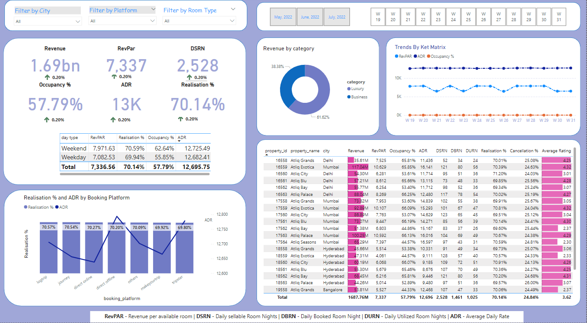

# Hotel Booking Analytics Dashboard

## Overview
This project creates an interactive Power BI dashboard to analyze hotel booking data. Using datasets of hotels, rooms, bookings, and revenue, we uncover trends in booking patterns, revenue performance, and customer feedback.

---

**Dataset Details** : [CodeBasics](https://codebasics.io/challenge/codebasics-resume-project-challenge)

The analysis is based on the following CSV files:
- dim_date: Date metadata (weekends, weekdays, and months).
- dim_hotels: Hotel details, categories, and locations.
- dim_rooms: Room types and classifications.
- fact_aggregated_bookings: Aggregated booking data by room and hotel.
- fact_bookings: Detailed customer booking transactions.

---

**Key Insights**
- Revenue Analysis: Generated vs. realized revenue by room and hotel categories.
- Booking Trends: Patterns over weeks, months, and platforms.
- Occupancy Rates: By city and room type.
- Customer Feedback: Ratings and booking platform trends.

---
## Power BI - Dashboard

